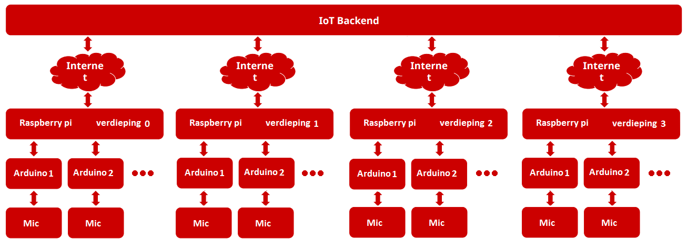

#IoT QuietTime
* Brecht Carlier
* Stijn Schrauwen
* Bart Kerstens
* Arne Schoonvliet

## Inleiding
In ons derde jaar op AP Hogeschool wordt er van ons verwacht een IoT project te maken. Wij maken deze in groepjes van vier.
Het doel van dit project is dat onze kennis wordt getest en dat we op zelfstandige basis een project kunnen uitvoeren.

In ons project hebben we een aantal doelstellingen. Een zeer belangrijke hiervan is het plannen en het verdelen van taken. We werken in een groep van vier. Hier moet zeker de nodige planning gebeuren willen we tot een succesvolle project komen. We leren hier bepaalde technieken voor die ons hierbij kunnen helpen!
In ons latere leven zullen we hier ook mee te maken krijgen. We zullen ook vindingrijk moeten zijn bij het oplossen van problemen. Niet alles gaat van de eerste keer en we zullen zeker eens een probleem hebben en dat moeten we succesvol kunnen oplossen. Dit zal tevens belangrijk zijn in ons dagelijks leven. Onze werkhouding en ons gedrag binnen de groep en tegenover derden is ook een belangrijke doelstelling!

Het algemeen doel van ons project is dat we in een werkelijke situatie ervaring opdoen.
In dit dossier vindt u de schriftelijke neerslag van en de extra informatie van onze taken. Wij wensen jullie nog veel leesplezier in ons portfolio.

Brecht Carlier, Arne Schoonvliet, Bart Kerstens en Stijn Schrauwen

## Doelstellingen
De hoeveelheid geluid bepalen binnen een bepaalde ruimte en dit weergeven op een website.
We hebben hier een IoT netwerk (RF24 Mesh) voor nodig om de data (Microfoon) van de verschillende ruimtes naar een device te sturen dat verbonden is met het internet (Rasberry Pi).

## Microfoon
Om de hoeveelheid geluid te kunnen bepalen binnen een bepaalde ruimte moeten we een device hebben dat geluid kan detecteren. We hebben ervoor gekozen om een microfoon te gebruiken dat analoge data genereert afhankelijk van het geluid.

### MAX4466
We hebben ervoor gekozen om een kloon van de Adafruit Electret Microphone Amplifier - MAX4466 with Adjustable Gain te kopen bij mchobby.be . Na eerst wat tegenslag te hebben gehad door het kopen van een microfoon waarbij geen analoge uitgang was zijn we toch blij dat we deze microfoon gevonden hadden. Het is zeker geen ideaal component voor onze toepassing maar om de kosten niet absurd hoog te laten gaan is dit de ideale oplossing. 

#### Specificaties
Een microfoon alleen is niet genoeg om aan de ADC (analog digital converter) te hangen. Het signaal moet versterkt worden en dit doet de MAX4466. Dit is een low cost micropower microphone amplifier. Deze werkt van 2.4V tot 5.5V, heeft een goede  Power-Supply Rejection Ratio (112dB) en Common-Mode Rejection Ratio (126dB). Verder is het stroomverbruik beperkt op slechts 24µA in normale omstandigheden.

#### Gebruik
We hebben deze microfoon natuurlijk niet zelf opgebouwd. We hebben deze opgebouwd gekocht zodat we deze ook onmiddellijk konden gebruiken. Het aansluiten van deze microfoon is ontzettend gemakkelijk. We hebben maar 3 pinnen: de VCC (3.3V), OUT en de GND. Waar VCC en GND moeten is duidelijk en de OUT hangen we aan een analoge ingang van de ADC.


### Code
Een kort woordje uitleg over de code in verband met de microfoon. Deze code is de standalone code voor de microfoon maar word gebruikt in de eigenlijke node code. Voor de uitleg van deze code lijkt het me makkelijker om dit op deze manier te doen.


Eerst hebben we enkele globale variabele die we initialiseren en verder zorgen we dat we de serial initialiseren voor debug doeleinde.
```c
const int sampleWindow = 50; // Sample window width in mS (50 mS = 20Hz)
unsigned int sample;
 
void setup() 
{
   Serial.begin(9600);
}
 
```

Dan gaan we verder naar onze eigenlijke meting van de het geluid. We starten met het initialiseren van variabelen naar hun startwaarden. Dan gaan we voor 50ms het geluid meten dat de microfoon opvangt. We slaan de hoogste en de laagste waarde op. Na de 50ms berekenen we de peak-to-peak waarde van het geluid en zetten deze om in de eigenlijke voltages. Dit geven we weer op het debug venster. In de eigenlijke node code zal deze data verstuurd worden naar de Raspberry Pi 2.

```c
void loop() 
{
   unsigned long startMillis= millis();  // Start of sample window
   unsigned int peakToPeak = 0;   // peak-to-peak level
 
   unsigned int signalMax = 0;
   unsigned int signalMin = 1024;
 
   // collect data for 50 mS
   while (millis() - startMillis < sampleWindow)
   {
      sample = analogRead(0);
      if (sample < 1024)  // toss out spurious readings
      {
         if (sample > signalMax)
         {
            signalMax = sample;  // save just the max levels
         }
         else if (sample < signalMin)
         {
            signalMin = sample;  // save just the min levels
         }
      }
   }
   peakToPeak = signalMax - signalMin;  // max - min = peak-peak amplitude
   double volts = (peakToPeak * 3.3) / 1024;  // convert to volts
   delay(100);
 
   Serial.println(volts);
}
```

### Voor - en nadelen
##### - Voordelen
* Deze microfoon is gemakkelijk te gebruiken. Iedereen die een ADC kan uitlezen kan deze gebruiken
* Afhankelijk waar je de microfoon koopt is deze niet prijzig
* Er is een potentiometer op geïnstalleerd zodat je de gain van de pre-amplifier kan instellen

##### - Nadelen
* De sensitiviteit van de microfoon is niet optimaal
* Het totale bereik van de microfoon had beter gekunt
* Het meest ideale zou zijn dat we een microfoon hadden die dB waardes zou kunnen geven. Dit zou de prijs absurd hoog brengen en we hebben er dus voor gekozen om dit niet te doen.
 

##XBee
Xbee’s zijn modules gemaakt door Digi. Deze embedded modules bieden de mogelijkheid tot draadloze eindverbindingen tussen apparaten. Deze modules gebruiken het IEEE 802.15.4 netwerkprotocol voor snelle point-to - multipoint of peer - to-peer netwerken. Ze zijn ontworpen voor high-throughput toepassingen die een lage latency en voorspelbare communicatie timing. XBee is Digi’s eigen zigbee gebaseerd protocol. Wat minder praktisch aan een XBee is, is de manier van programmeren. Als u dit via usb wilt doen moet u eerst de microcontroller uit de arduino halen. Als u dit niet doet zal er via USB communicatie zijn tussen de computer en de microcontroller maar geen van beide zal de Xbee module kunnen bereiken. De Xbee sluit u op de Arduino aan via een schield. Op dit schield zijn 2 jumpers aanwezig plaats deze voor het programmeren van de Xbee naar USB positie.

###Wat hebben we bereikt
We hebben een succes volle p-p connectie bereik tussen 2 Xbee S1. Jammer genoeg kunnen Xbee S1 niet in een mesh samen werken. Na onderzoek bleek dat de S2 hiervoor wel geschikt waren. Nadat onze school hiervan niet in het bezit was. Kozen we voor de ESP8266. Waarom dit toch niet de oplossing bleek te zijn kan u in een apart hoofdstuk over ESP8266 lezen. RF24 modules boden ons de uiteindelijke oplossing aan.

###Het verschil tussen XBee S1 en S2
Om te beginnen is een groot verschil tussen de 2  dat de S1 modules niet geconfigureerd kunnen worden, waar de S2 modules eerst geconfigureerd moeten worden. Dit maakt de S1 modules makkelijk in gebruik maar de toepassingen zijn beperkt tot point to point communicatie. Dit kan je ook met S2 modules maar S1 modules kunnen dit zonder enige configuratie. De S2 modules kunnen zowel in transparante modus werken als met API  commando’s Dit hangt af van de firmware die je gebruikt om de XBee’s mee te configureren. Werkend in de transparante modus werken de modules als seriële lijn vervanger. Alle UART data ontvangen op de Din wordt opgeslagen voor RF transmissie. Wanneer RF-data ontvangen wordt zal de opgeslagen data worden verzonden door de Dout pin. De module configuratie parameters worden geconfigureerd met de AT command mode interface. API bediening is een alternatief voor transparante werking . Het frame- gebaseerde API breidt de mate waarin een host- toepassing kan communiceren met de netwerkmogelijkheden van de module Uit. in API -modus , alle gegevens binnenkomen en uitgaand zijn opgenomen in frames die handelingen of gebeurtenissen binnen de module te definiëren. Een groot voordeel van de S2 modules tegen over de S1 modules, is de mogelijkheid tot het werken binnen een mesh netwerk. Je kan de S1 series onderscheiden van de S2 series door naar een opschrift op de module te zoeken. Is er geen spoor van een  opschrift dat wijst op de serie, Dan heb je te maken met een S1 in geval van een S2 zal dit op de module staan. S1 en S2 modules zijn onmogelijk compatibel.

###Verschil 802.15.4 en Zigbee
802.15.4 is een standaard opgesteld door IEEE, momenteel misschien de grootste standaard voor kleine data pakketjes WPANs (wireless personal area network). Er zijn vele sub categorieën. De standaard wordt veelal gebruikt bij het monitoren en besturen van applicaties met kleine data trafiek, een lange levensduur en een laag stroomverbruik. De 802.15.4 standaard gebruikt enkel de 2 onderste lagen van het osi model. Namelijk de fysische en de data link laag(Mac).  Buiten deze 2 lagen gebruikt 802.15.4 enkel nog logical link control (LLC) en service specific convergence sub-layer (SSCS) om te communiceren met alle hogere lagen zoals aanvullende standaarden (zoals zigbee) bepalen. De standaard is dus ontworpen om als basis te dienen voor andere protocollen en functies. De meest bekende uitbreiding op 802.15.4 is dus ZigBee. Een standaard van de ZigBee alliantie. ZigBee gebruikt lagen 3 en hoger van het osi model. Hier zullen zaken als authenticatie, encryptie en data routering voor het gebruik van een mesh netwerk mogelijk zijn.
 

##WiFi Module - ESP8266
De ESP8266 WiFi module is een op zichzelf staand “System on a chip” (SoC) met geïntegreerde TCP / IP-protocol stack. De ESP8266 kan zowel connecteren naar een wifi netwerk, als er zelf een hosten. Elke ESP8266 module komt voorgeprogrammeerd met een AT commando set firmware, m.a.w. u kunt hem aansluiten aan je Arduino en je hebt dezelfde functionaliteit die een  wifischield zou bieden. Het mooie aan deze module is dat ze krachtig genoeg is om intern processen uit te voeren en data op te slaan. Het is mogelijk om aan deze module sensoren aan te sluiten zonder een arduino en een arduinoprogramma rechtstreeks in de module up te loaden. Verder heeft hij een zelf kalibrerende RF-module zodat geen externe RF onderdelen nodig zijn.

##ESP8266

####Wat is er (niet) gelukt?
Ons doel was om NodeMCU op de ESP8266 te flashen. Dit was custum firmware waardoor we de mogelijkheid kregen om de ESP8266 te prgrammeren in 'Lua'.

[Tuturial](http://www.whatimade.today/loading-the-nodemcu-firmware-on-the-esp8266-windows-guide/)

Dit lukte. De NodeMCU firmware stond geflasht op de ESP8266. We hebben dit gedaan met dezelfde tool als in de tuturial [NodeMCU flasher](https://github.com/nodemcu/nodemcu-flasher). Nu kwam echter de grote vraag, wat nu? We moeten toch ergens code kunnen invullen? In de turial stond dat we dit moesten doen via Putty. Owkay zo gezegd zo gedaan. Probleem 1 we waren nooit zeker over de baudrate... Maar we namen uiteindelijk dezelfde als de baud rate die we gebruikt hebben tijdens het flashen van de NodeMCU firmware. Maar nog steeds, wat nu? Alles dat we invullden had geen effect...

Tijd om een alternatief te vinden. We vonden een *Lua Editor* waarin we dus al onze Lua code konden uitvoeren op de ESP8266. We konden dit echter niet aan de praat krijgen. Door de onduidelijke GUI en slecht gedocumenteerde site wisten we echt niet wat we verkeerd deden...

We waren dit aan testen op uw NodeMCU DevBoard V1. U had nog een andere ESP8266 module (Arne heeft deze gesoldeerd). Deze zijn we dan beginnen gebruiken maar dezelfde problemen waren hier ook aanwezig. We hadden hier zelfs meer problemen bij, het flashen van de NodeMCU firmware ging hier niet zo vlot als op uwe DevBoard.

Uiteindelijk heb ik een eigen ESP8266 besteld en ook een USB programmer (TTL => 3,3V). Maar kwam ik na levering eigenlijk tot de conclusie dat die nuteloos waren, ze hadden immers geen analoge aansluiting!

De moed begon steeds de zakken, de tegenslagen met de draadloze communicatie waren enorm. We hebben daarom besloten om terug naar de basics van Labo 2 te gaan!

#### Wat had het kunnen worden?
Zoals het hier boven staat, de ESP8266 is niet zomaar een WiFi module. Het is een vollidge SoC. Er zit een microcontroller in verwerkt die meer 'power' heeft dan de ATMEGA 328 van onze Arduino UNO. Het had dus perfect mogelijk geweest om de Arduino en de Raspberry Pi gewoon te verwijderen uit ons project!

We zouden de Arduino kunnen verwijderen omdat sommige varianten van de ESP8266 (Bijvoorbeeld de ESP8266-12) beschikken over een ADC. Zo zouden we niet meer moeten samplen op de Arduino, maar zou deze taak ook volbracht kunnen worden door de ESP8266. Dit heeft als voordeel dat er component minder stroom verbruikt..

Met de ESP8266 hadden we via het AP wifi netwerk kunnen communiceren, deze is toch al beschikbaar waarom dan niet gebruiken (minder radiogolven in de lucht). Ook hadden we rechtstreeks 'POST' requests kunnen schrijven naar een cloud server (NodeJS, PHP, ...). We hadden ook de mogelijkheid gehad om via WiFi connectie te maken met onze microfoon (get). Zo hadden we de status kunnen vragen van de sensor en andere zaken.

De opties zijn bijna oneindig, het had een mooier IoT project opgeleverd. Brecht Carlier is van plan om met zijn eigen ESP8266 eens te spelen. Het is echt een zeer interssant en hip component in de IoT wereld!

#### Update

> The easiest way to communicate with the ESP8266 is to open Putty, select the right COM and start writing. It will be a bit frustrating since you have to write a line and end it with CTRL-J to send it to the ESP826

Dit vond ik tijdens het opmaken van dit verslag, ik heb nooit de toetsencommando CTRL+J gebruikt. Misschien was dit onze fout en werkte het gewoon. Alhoewel ik het zelf betwijfel aangezien er echt niets in het PuTTY venster verschijnt.

Maar dit kan misschien een tip zijn voor de mensen van volgend jaar!

##RF24
Na al onze pogingen om een draadloos netwerk te bouwen, grijpen we terug naar de basis. Dankzij opzoekwerk had ik een bibliotheek gevonden om via RF een draadloos mesh netwerk te bouwen. RF (Radiofrequent) hebben we al gebruikt tijdens het labo van IoT. We hebben toen gebruik gemaakt van de nrf24l01. We wisten sowieso dat deze modules werkten, en we hadden er ook veel op het school.

Beide vorige pogingen miste één van deze kenmerken. De RF modules hadden twee groote nadelen. 
-  Standalone is onmogelijk
-  Timeslots, kanaal reservingen (wie mag er zenden), ...

Het eerste nadeel kunnen we niet oplossen met onze nrf24l01 modules, er zal steeds aan elke sensor een Arduino moeten hangen. In de praktijk kunnen we een zeer kleine Arduino gebruiken (Arduino Nano, Arduino Mini, ...).

Het tweede nadeel, lost onze bibliotheek op. In ons mesh netwerk zal er één node master zijn (Raspberry Pi), en zullen er verschillende sensor nodes zijn (Arduino + Microfoon). Deze "slaves" zullen data verzenden naar onze master. Maar dit moet uiteraard geregeld worden. Zo zijn er verschillende adressen die geconfigureerd moeten worden, moeten er "reading" en "writing" pipes geopend worden om te communiceren en nog veel meer. Wat bijvoorbeeld als er twee nodes tegelijk zenden en etc. Dit probleem is ondertussen al opgelost en dat netwerk noemen we het internet :). Er is echter ook een bibliotheek voor RF die gelijkaardige functionaliteit toevoegd aan ons project. Deze bibliotheek is zelfs TCP/IP stack compatibel. Zo is er DHCP, ARP, ... functionaliteit beschikbaar.

Hier moeten we ons al geen zorgen meer om maken. De RF24Mesh bibliotheek zorgt hier wel voor...</br>
TMRh20 heeft een fork gemaakt van de origele RF24 bibliotheek, en heeft deze verbeterd (under statement) en uitgebreid. Hij is ook de ontwikkelaar van de RF24Netwerk (Netwerk laag, DHCP functionaliteit, ...) en RF24Mesh bibliotheek. Hij heeft alles zeer goed gedocumenteerd! Ik raad zeker aan om zijn documentatie eens een kijkje te geven 

- RF24 (fork van het origineel) => [LINK](http://tmrh20.github.io/RF24/)
- RF24Netwerk (netwerk layer van het OSI model) => [LINK](http://tmrh20.github.io/RF24Network/)
- RF24Mesh => [LINK](http://tmrh20.github.io/RF24Mesh/classRF24Mesh.html)

Door de schitterende documentatie is het gebruik van deze bibliotheken echt gemakkelijk. Indien je deze in Arduino wilt gebruiken kun je gebruik maken van de 'Bibliotheekbeheerder'. Door te zoeken naar RF24 kun je de 3 bibliotheken vinden. Nadat je deze geïnstaleerd hebt zullen ook de examples tevoorschijn komen bij *Bestand -> Voorbeelden*.


In het labo hebben we ineens geprobeerd de RF24Mesh te testen, dit lukte niet. Thuis heb ik besloten om alles stap voor stap te testen. Te beginnen bij de basis, RF24/GettingStarted. Dit is eigenlijk LABO2 van tijdens de labosessies van IoT. Dit werkte niet van de 1ste keer. Toen heb ik gewoon onze sketch van Labo2 geprobeerd en kwam ik tot de conclusie dat de rf module niet werkte. Later bleek dat hij wel werkte maar de connecties 'zwak' waren. Als je er mee schudde werkte hij wel. Dit terzijde.

Ik had gelukkig nog een 3de RF module meegenomen naar huis en heb als eerst terug onze sketch van LABO2 geprobeerd. Dit werkte en daarna de GettingStarted sketch en na een paar aanpassingen werkte dit ook. Zo we hadden een basis waar we verder mee konden.

Mijn volgende stap was om één van de Arduino's te vervangen door onze Raspberry Pi2. Allereerst moesten we de RF module verbinden met onze Raspberry Pi 2, dit gaat via de 40 pins header. 


Je kunt hier duidelijk de pinnen voor SPI zien! 


We hebben de RF24 als volgt aangesloten:

| RF24       | RPI            |
|------------|----------------|
| PIN1: 3.3V | PIN1: 3.3V     |
| PIN2: GND  | PIN6: GND      |
| PIN5:CE    | PIN1: GPIO22   |
| PIN7:MISO  | PIN19:MISO     |
| PIN8:MOSI  | PIN21:MOSI     |
| PIN9:CLK   | PIN23:CLK      |
| PIN10:CSN  | PIN24:SPIO CS0 |

Als volgende stap moest ik de RF24 bibliotheken installeren op onze RPi 2. Ik heb dit gedaan door de volgende stappen te volgen:

[Installatie process op Raspberry Pi](http://tmrh20.github.io/RF24/RPi.html)

Hierin wordt dus verteld hoe ik de code van alle RF24 bibliotheken op mijn RPi krijg, er bevind zich ook een map bij waarin examples voor de RPi staan. We builden de bestanden in de juiste map */home/IoT/rf24libs/RF24/examples_RPi*. En we voeren op de RPi ook de GettingStarted sketch uit. Dit werkte!

> [Code Arduino](http://tmrh20.github.io/RF24/GettingStarted_8ino-example.html) </br>
> [Code RPi2](http://tmrh20.github.io/RF24/GettingStarted_8cpp-example.html)

Als volgende stap heb ik eerst RF24Network getest. De RF24Mesh bibliotheek maakt hier gebruik van, dus wou ik eerst zeker zijn dat dit werkte. Ik test eerst helloworld_tx op Arduino en helloworld_rw op RPi2 en hierna andersom. Beide situaties werkten!

> [Arduino Helloworld_tx](http://tmrh20.github.io/RF24Network/helloworld_tx_8ino-example.html)</br>
> [Arduino Helloworld_rx](http://tmrh20.github.io/RF24Network/helloworld_rx_8ino-example.html)

> [RPi Helloworld_tx](https://github.com/TMRh20/RF24Network/blob/master/examples_RPi/helloworld_rx.cpp)</br>
> [RPi Helloworld_rx](https://github.com/TMRh20/RF24Network/blob/master/examples_RPi/helloworld_rx.cpp)

Onze logische volgende stap is de examples testen voor de RF24Mesh bibliotheek. Op de Arduino zullen we de 'slave' sketch starten en op de RPi de 'master' sketch. De master node is de node die de adressen en etc. zal verdelen. Deze sketch wordt verder in deze tekst uitgelegd. Deze keer werkte het van de 1ste keer.


> [Code Arduino](http://tmrh20.github.io/RF24Mesh/RF24Mesh_Example_8ino-example.html)</br>
> [Code RPi2](http://tmrh20.github.io/RF24Mesh/RF24Mesh_Example_Master_8cpp-example.html)

Nu we dit werkend hebben, is het de bedoeling dat we ons netwerk uitbreiden. We moeten dus een extra sensor in het netwerk koppelen.
We doen dit door de Arduino code nog eens up te loaden naar een andere Arduino met RF zender. Het enigste wat we moeten aanpassen is de NodeID, 2 keer dezelfde mag niet voorkomen in het zelfde netwerk (vgl met MAC adres). Dit werkt ook! Ons mesh netwerk is gebouwd!


De laatste stappen zijn de Arduino code integreren in de sketch van de Microfoon (@Arne Schoonvliet) en de sketch van de RPi2 aanpassen naar onze noden. Dit leest u in het volgende deel!

##RaspPI code 

```c
//Include the correct libaries
#include "RF24Mesh/RF24Mesh.h"
#include <RF24/RF24.h>
#include <RF24Network/RF24Network.h>

//Init our RF modules, Start SPI!
RF24 radio(RPI_V2_GPIO_P1_15, BCM2835_SPI_CS0, BCM2835_SPI_SPEED_8MHZ);
RF24Network network(radio);
RF24Mesh mesh(radio,network);

int main(int argc, char** argv) 
{
	// Set the nodeID to 0 for the master node
	mesh.setNodeID(0);
	// Connect to the mesh
	mesh.begin();
	
	while(1)
	{
		// Call network.update as usual to keep the network updated
		mesh.update();

		// In addition, keep the 'DHCP service' running on the master node so addresses will
		// be assigned to the sensor nodes
		mesh.DHCP();

		// Check for incoming data from the sensors
		while(network.available())
		{
			RF24NetworkHeader header;
			network.peek(header);
			uint32_t dat=0;
			
			//Check which data type we recieved
			switch(header.type){
				case 'M': network.read(header,&dat,sizeof(dat));
				  //%03d => Always have 3 numbers, if not lead it with zeroes => d (decimal)
				  //mesh.getNodeID() => Similear to ARP, gets node id from the node address
				  //dat => Actual data in our case, the sound intensity
					printf("%03d%u\n",mesh.getNodeID(header.from_node),dat);
					break;
				default:  network.read(header,0,0);
					printf("Rcv bad type %d from 0%o\n",header.type,header.from_node);
					break;
			}

			fflush(stdout);
		}
	  
		delay(2);
		
	}
	
	return 0;

}
```

De code is vrij 'self-explanatory'. We moesten een paar dinges toevoegen aan de example code en dan waren we al klaar voor wat betreft het ontvangen van de data!

### Printen van de data
Het is de bedoeling dat later elke regel die nu op het scherm verschijnt wordt verwerkt en toonbaar is op een website. Hierdoor moesten we dus een afspraak maken hoe de data eruit ziet. We hebben gekozen voor

> 123987

De eerste 3 cijfers stellen de Node ID voor van de sensor. Deze zullen later gebruikt worden om te bepalen in welk lokaal de sensor stond. We moesten ervoor zorgen dat deze altijd 3 cijfers lang was. Dus 1 moest 001 worden. We hebben dit zo gedaan:

> %03d

De laatste 3 cijfers stellen de *sound intensity* voor. Deze waarde is dus hoe luid het is in de omgeving van de sensor. Dit is de waarde die uitgelezen wordt door de ADC van de Arduino.

### ARP!?
Standaard werd het *node address* geprint op het scherm. Dit kun je vergelijken met het IP adress in een thuisnetwerk. Deze is immers ook door de 'DHCP service' uitgedeeld! Het probleem is dat deze dus kan veranderen. En dat mag niet één bepaalde sensor hangt in een kamer en die kamer die veranderd niet. Gelukkig is er ook een soort ARP oplossing en kunnen we gemakkelijk de *node id* te weten komen. Deze id hebben we ingesteld in de Arduino sketch op de node zelf!

### fflush(stdout)
De bedoeling is dat we de output van ons script gaan schrijven naar een bestand. STDout is het process waarop je momenteel je programma 'bekijkt', dit kan een SSH sessie zijn, een telnet sessie of gewoon lokaal via het scherm. Het is belangrijk dat we na elke keer we iets geschreven hebben, bij ons dus na de switch, we het sturen naar stdout! Zonder dit kan het zijn dat het in een buffer blijft staan! Waarom dit schadelijk is lees je bij 'Tee'.

### Tee
'Tee' is een functie in Linux waarbij je de output van je executable (script, programma, ...) kunt schrijven naar een file. Hoe doet 'Tee' dit?

> ls -l | **tee** output.txt

ls -l is ons programma dat schrijft naar stdout (zie uitleg hierboven). Tee "vangt" deze uitgang en zal deze schrijven naar de file *output.txt*. Indien gewenst kan dit ook nog verder gestuurd worden naar een stdin (input). De file wordt trouwens elke keer overschreden!

'|' is trouwens het 'pipe' symbool. Piping is een belangrijk concept in de Linux wereld. Piping is eigenlijk het doorsturen van data. Je vangt de output van een bepaald commando en stuurt het ineens door naar de input van een ander commando! En makkelijk voorbeeld is:

> \# cat /proc/cpuinfo | grep -i 'Model'.

Je zult het 'grep' commnado direct uitvoeren op de output van het 'cat' commando! Dit laat trouwens de modelnaam van je CPU zien!

Je snapt nu ook dat fflush(stdout) belangrijk is, zonder dat ons C++ zijn output niet schrijft naar stdout. Kun je met 'tee' niet veel doen!

Het gebruikte commando bij ons was dus: TODO

### Tail
Dit is ook een concept die enkel in de Linux wereld bekend is. Onze Node-Red server zal de 'Tail' functie uitvoeren op de file die ons 'Tee' commando gegenereerd heeft. Maar wat is dit nu?

'Tail' is een zeer simpel maar toch een krachting commando. Het zorgt immers dat elke aanpassing aan een file binnenkomt. Het wordt vaak gebruikt om de log files van server te bekijken. Je wilt vaak niet de volledige error log van het verleden bekijken, maar enkel de toegevoegde lijnen terwijl jij er aan bezig bent!

Elke keer als onze text file aangepast wordt zal Node Red de nieuwe lijn tekst binnen krijgen! Perfect wat we nodig hebben!

Bij deze bedanken we Dhr. Luyts nog eens voor zijn kennis van Linux, zonder hem hadden we deze commando's niet gekend. En was het project niet hetzelfde geweest!

##NodeRED
Node-RED zal dienen als onze backend. 

Node Red is een tool om gemakkelijk een IoT netwerk te bouwen. Het is bedoeld om de verschillende onderdelen van je IoT netwerk te 'verbinden' (laten communiceren) met elkaar. Het is een grafische tool dat werkt met click and drop ban bepaalde blokken. Je maakt verbindingen door lijnen te verbinden tussen blokken.

De blokken hebben verschillende functies (inputs, outputs, ...). Aangezien Node Red gewoon een versimpeling is van NodeJS kun je perfect eigen Javascript code schrijven, dit kun je doet d.m.v. de functie blok bijvoorbeeld! Maar dit betekend ook dat Node Red alle duizende modules van NodeJS kan gebruiken! Node Red wordt volledig ondersteund op onze Raspberry Pi daarom moeten we geen moeilijke compatibiliteit problemen verwachten!

Het is een simpele tool, en op nog geen 5 minuten kun je volledig cloud / IoT applicaties werkend hebben! Ook is Node Red redelijk goed gedocumenteerd, wat het prettig maakt om mee te werken! Er zijn ook wat debug opties wat leuk is tijdens het ontwikkelen. Het is een opensource project maar het is ontstaan door IBM, er zit dus een groot bedrijf achter met veel kennis en geld!

[Website Node Red](http://nodered.org/)

De bedoeling dat we hierin een mini REST API maken. Indien we een url bezoeken zal de data van onze sensoren weergegeven worden als JSON object.

We zullen dus gebruik maken van de **tail** functie die hierboven uitgelegd is. Elke keer als onze textfile wijzigt zal Node Red de laatst geprint string ontvangen. Dit is dus een getal van 6 cijfers (zie hierboven).

Elke keer Node Red deze string ontvangt, wordt de SaveSound() functie uitgevoerd. Deze functie zorgt ervoor dat onze sensor data upgedate wordt of toegevoegd wordt.

####SaveSound()

Hier maken we onze array aan waar we onze sensoren zullen in opslaan. Deze moet uiteraard enkel aangemaakt worden indien de array nog niet gedefenieerd is. We slaan deze array globaal op zodaning ons volledig project eraan kan!

```javascript
//If our array doesn't exsist yet
//Make it!
if(context.global.data === undefined)
{
 context.global.data = [];
}
```

Deze code dient om snel de volledige array te verwijderen, we hebben dit erin gezet omdat het wel eens makkelijk was tijdens het debuggen (code staat in commentaar zodat we snel de array kunnen 'resetten').

```javascript
//Code to delete context.global
//This was used while debugging code
//Sometimes we had to reset our array!
/*
for (var m in context.global)
{
 delete context.global[m];
}
*/
```

Hier maken we ons 'Sensor' object aan. De id van de sensor zijn de eerste 3 cijfers van de string die we opgeslagen hebben in onze file. Zoals u reeds weet zorgt de RPi dat de id altijd 3 karakters bevat (leading zero's toevoegen). De volgende 3 karakters komen overeen met de geluidsintensiteit gelezen door de microfoon. Deze plaatsen we ook in ons object onder de het field sound. We slaan ook de huidige datum (+ uur) op, zo kunnen we later kijken hoelang het geleden is sinds de sensor is upgedate!

```javascript
//Make our sensor object
sensor = {};
//The first 3 chars are the ID
sensor.id = msg.payload.substring(0, 3);
//The next 3 chars is the sound instensity
sensor.sound = msg.payload.substring(3, 6);
sensor.date = new Date();
```

Volgende stap bestaat eruit de sensor toe te voegen of het bestaande sensor object up te daten. Indien het een nieuwe sensor is voegen we toe, indien hij al bestond daten we up.

Standaard is er een bool (newSensor) true, indien deze true blijft weten we dat het sensor object nog niet is toegevoegd in onze array.

We loopen voor we de nieuwe sensor toevoegen nog eerst over de bestaande sensoren. Mocht het blijken dat de id van de sensor al gebruikt is, dan moeten we niet toevoegen maar de bestaande sensor up daten. Onder updaten verstaan we de sound en date field aanpasen naar de nieuwe waardes. We zetten newSensor op false, deze sensor moet immers niet opnieuw toegevoegd worden!

Mocht de newSensor dus nog steeds true blijken, dan voegen we de sensor toe aan onze array.

```javascript
//Variable (bool) to check if it's a new sensor
var newSensor = true;

//For loop for updating our exsisting sensors
//If the sensor isn't in our array
//newSensor will stay true
for(var s in context.global.data)
{
 if(context.global.data[s].id === sensor.id)
 {
 context.global.data[s].sound = sensor.sound;
 context.global.data[s].date = sensor.date;
 newSensor = false;
 }
}

//If it's a new sensor put it inside our array!
if (newSensor === true)
{
 context.global.data.push(sensor);
}

return context.global;
```

####GetTime()
Inden we een get request doen naar de route /test zal de GetTime() functie aangeroepen worden! De functie zal onze globaal opgeslagen array returnen via http!

Voor we deze returnen zullen we kijken of een sensor verwijderd moeten worden uit de array. Dit doen we indien de sensor al geruime tijd geen data meer heeft gezonden (defect).

```javascript
var now = new Date();

for(var i = context.global.data.length -1; i >= 0; i--)
{
 //If the sensor didn't recieve new values for 60000 ms (1 minute)
 //Remove it from the array
 if(now.getTime() - context.global.data[i].date.getTime() > 60000)
 {
 context.global.data.splice(i, 1);
 }
}

msg.payload = context.global.data;
return msg;
```

Indien we nu surfen naar het IP adres van de RPI op poort 1880, en als route test (m.a.w. 192.168.137.144:1880/test). Zullen we onze array zien in JSON formaat! Nu kan Bart deze data gebruiken in zijn front end code.

##Raspberry Pi
We maken dus gebruik van een Raspbeery Pi 2. Maar wat is dit nu juist?

Een Raspberry Pi is een signeloboardcomputer gebaseerd op ARM processoren. Ze zijn zo bekend geworden omdat ze zo goedkoop worden verkocht. Hun doel is immers om mensen aan het ontwikkelen te brengen aan een lage kostprijs. Zo zijn er veel projecten in 3de wereld landen waar ze de RPi gebruiken.

Echter heeft de RPi niet enkel aantrek bij studenten en derde wereld landen, ze worden ook volop gebruikt door tweakers. Je bent perfect instaat om van je RPi een klein goedkoop mediaservertje te maken!

RPi gebruikt dus ARM processoren. Dit zijn de processoren die je vaak vind in smartphones en tablets. Je kunt er niet de standard versie van Windows op draaien (x86), daarom is het Linux ecosysteem hier de dominante positie. Er zijn veel Linux distrubuties die de RPi ondersteunen!

Wij gebruiken de RPi 2, dit is het krachtigste model dat ze nu hebben. Het beschikt over een quard core Cortex A7 processor op 900Mhz. De GPU is nog steeds dezelfde als de eerdere / andere varianten. Namelijk een Broadcom VideoCore IV.

Het stroomverbruik is maximaal 400/500mA wat resulteert in een vermogen van 2 à 2,5W maximaal!

We hebben Raspbian Jessie Lite geïnstalleerd, dit is een minimale versie zonder GUI. We zullen gebruik maken van SSH om te werken op onze RPi. Ik heb dit gedaan door mijn Windows computer als DHCP server in te stellen. Je kunt dit makkelijk doen je WiFi (internet van het school) adapter te delen. Je computer speelt dan eigenlijk router, je lan netwerk zal hierdoor via je WiFi beschikken over internet. De apparaten op je het lan netwerk van mijn laptop zullen nu een IP adres krijgen van mijn laptop. Het ip adres van mijn ethernet adapapter zal nu altijd 192.168.137.1 zijn. De dhcp lease is een /24!

Een fantastische feature van Windows, maar ze zijn iets vergeten. Je kunt namelijk niet zien welke IP adressen je least als DHCP server. We weten dus niet wat het IP adres is van onze RPi. Maar dit kunnen we makkelijk oplossen door nmap te gebruiken. Met het volgende commando scan je het volledige netwerk (192.168.137.0):

> nmap -sn 192.168.137.*

De -sn staat voor dat er geen port scan moet gebeuren, we hebben enkel het IP adres nodig!

Vanaf we dit nu hebben, kunnen we SSH'en naar de RPi (wel eerst instellen in boot menu). Wij maakten gebruik van Bitvise SSH Client. Hier zit ook SFTP support in, zo kunnen we makkelijk files van de Windows computer slepen naar onze RPi.

##Heatmap uitleg
*Javascript library voor het visualiseren van heat points in bepaalde gebieden*

###HTML
*Alle code die in HTML gebruikt wordt*

####div: class heatmap

div waar de heatmap terecht komt

####style .heatmap
*styling voor de heatmap class*

hier worden de volgende elementen aangepast voor de heatmap:
* display: block (vorm van de heatmap)
* height: hoogte van de heatmap
* width: breedte van de heatmap
* position: plek waar de heatmap in het scherm tevoorschijn komt
* background-image: de afbeelding waar de heatmap over komt

###Scripts

####Library's
* heatmap.js : bibliotheek voor heatmap te kunnen gebruiken
* Jquerry.min.js : Jquerry kunnen gebruiken

####Code ( opzetten van alles )

#####Sensor
*Array met sensor objecten*

Elk sensor object bevat het volgende:
* place: String, plaats waar de sensor zich bevindt
* x: number, x-coördinaat van de map
* y: number, y-coördinaat van de map
* value: number, waarde die men krijgt van de Json file
* radius: number, grootte van de cirkel van een value

#####Data
*data formaat dat door de heatmap wordt aangenomen*

Dit bevat twee dingen:

* max: maximale waarde die men binnenkrijgt ( deze zal visueel een rode kleur krijgen )
* sensor: alle sensorobjecten die werden ingesteld staan in deze array

om deze op de heatmap te zetten maken we gebruik van een functie van de heatmap library: *heatmapinstance.setData(data)*

####Code (invullen van de heatmap)

Voorgaande code was allemaal voorbereiding voor de heatmap en de sensoren te kunnen gebruiken.
Onderstaande code zal meer uitleg geven over hoe we aan data van de sensoren geraken en hoe we deze in de heatmap gaan zetten.

#####Sensordata uitlezen

Dit wordt gedaan via de *refreshData()* functie die we gemaakt hebben.
Deze zal een ajax call doen naar een bepaalde pagina op een site die we hebben opgezet.
Het datatype dat we vragen is in *jsonp* gezien we hierdoor cross scripting restricties kunnen ontwijken die we normaal zouden krijgen als we een *json* formaat zouden vragen.

```javascript
function Refreshdata() {
    $.ajax({
        url: "http://192.168.137.144:1880/test",
        dataType: 'jsonp',
        success: function (data) {
            obj = data;
            }
    });
    return obj;
}
```

Als dit succesvol gebeurd returnen we het jsonp object in een global object dat we in het project gaan gebruiken voor de sensoren in te vullen.

#####Sensordata invullen

Een sensorobject in het global object met sensorwaarden bevat 2 dingen:
* id: hiermee kunnen we bepalen over welke sensor het gaat
* value: waarde die de sensor geeft bij een bepaald geluid signaal

In onze *Update()* functie gaan we de data van onze sensoren invullen.
```javascript
function Update()
{
    var sensorData = Refreshdata();

    for(var s in sensorData)
    {
        if (sensorData[s].id == 1)
        {
            sensor[0].value = sensorData[s].sound * 10;
            sensor.push(sensor[0].value);
        }
        else if (sensorData[s].id == 2)
        {
            sensor[1].value = sensorData[s].sound * 10;
            sensor.push(sensor[1].value);
        }
    }
```

Eerst gaan we de hele array van het gereturnde object doorlopen en kijken of we onze sensoren er uit kunnen halen afhankelijk van hun *sensorid* (lookup table).
Bij een match gaan we de waarde van de sensor eerst moeten vermenigvuldigen omdat de waarde van de sensor te klein is om direct mee te werken in ons programma. Als dit gebeurt is stellen we de waarde van de ingelezen sensor gelijk aan het matchende sensorObject dat we daarstraks hebben aangemaakt.
Hierna pushen we sensorObject.value terug in de array zodat deze de laatst binnengehaalde data heeft.

Uiteindelijk wanneer alle sensoren zijn uitgelezen die we hadden binnengebregen roepen we terug *heatmapinstance.setData(data)* aan om alle nieuwe waarden op de heatmap weer te geven.
```javascript
    heatmapInstance.setData(data);
}
```

####Loop

Omdat bovenstaande gewoon functies zijn moeten we ervoor zorgen dat deze constant worden uitgevoerd om de laatste info van de sensoren op de heatmap te zetten. Dit gebeurt door een interval in te stellen van een gekozen tijd (500ms in ons geval) en dit de *Update()* functie uit te laten voeren. Gezien de *refreshData()* wordt aangeroepen in de *Update()* functie wordt deze automatisch terug gebruikt.
```javascript
   setInterval(function () {
        Update();
    }, 500);
}
```

##Architectuur
###In werkelijk heid




Moesten we dit project in werkelijkheid gaan uit voeren. Dan zouden we per verdiep een Raspberry Pi voorzien. Deze zou communiceren met de Arduino sensor nodes via RF24. Via het internet zou de data verstuurd worden naar een Rest API. We zouden dus onze Node-Red moeten aanpassen dat hij geen 'get' doet maar een post. In de cloud staat er dan bijvoorbeeld een node server waar we via een REST api deze post kunnen verwerken.
De REST API zal dan ook gets hebben waardoor we de data op de front-end kunnen visualizeren (Heat map genereren). Per lokaal zou minstens een arduino geplaatst worden die met de Raspberry Pi van dat verdiep communniceerd. Op de Arduino's zullen microfoons en RF24 modules worden aangebracht. De Arduino's fungeren als slave nodes in het sternetwerk.

###Labo

In de praktijk moet er dan ook gekeken worden of het verbruik van onze setup toegestaan is. De Arduino zal naar alle waarschijnlijkheid vervangen moeten worden naar een kleiner en zuiniger model. Ook moeten we dan experimenteren of we aan meshnetworking gaan doen, onze soft- en hardware ondersteund het. Zo kunnen we misschien een beter bereik tewerk stellen. Mocht dit toch niet lukken kunnen we nog altijd krachtigere RF modules proberen (met een echte antenne i.p.v. pcb antenne). Er zou ook gekeken kunnen worden om 2 microfoons te plaatsen en via het meshnetwerk data tussen de Arduino's te sturen (samenwerken).

Er is nog veel dat kan, maar jammer is het project op zijn einde gelopen!


In het labo hebben we een testopstelling gebouwd. Deze bestond uit één Raspberry Pi 3 waar de backe-nd op draaide de front-end zal via het lokaal netwerk de data ophalen. De Raspberry Pi 2 communiceerde met 2 arduino's met elks een RF24 module en een microfoon.


## Conclusie
De bedoeling was dat je leerde samenwerken in groep en leerde plannen van zo een groot project. Dit als voorbereiding voor onze bachelor proef in het derde jaar. Verder was dit ook een onderzoek naar het ontdekken van de IoT wereld. We kunnen concluderen dat dit onderzoek zeer interessant was. 
Omdat we in groep werkten was het belangrijk dat we een goede taakverdeling hadden. Als u naar het resultaat kijkt mag er geconcludeerd worden dat we dit uitstekend gedaan hebben. We hebben ons project afgekregen. We mogen hier zeer trots op zijn!
Verder was het ook een zeer leerrijk proces. Ééntje met up en down, iets wat ieder project wel heeft. We hebben leren werken met SPI en hoe we de nrf24l01 kunnen gebruiken binnen een IoT netwerk. Dit dankzij de uitstekende library die we gevonden hebbe. Het is verder belangrijk dat je samen achter een beslissing staat. Ook hebben we geleerd dat je eerste en ook je tweede en derde idee niet steeds het beste idee is en dat je moet durven veranderen 
We willen ook graag lector M. Luyts bedanken voor de hulp als we die nodig hadden. Zijn ervaring en zijn vindingrijkheid heeft ons zeker af en toe geholpen. 
Het was een leerrijk proces en we kijken uit naar onze bachelor proef.

Brecht Carlier, Arne Schoonvliet, Bart Kerstens en Stijn Schrauwen
